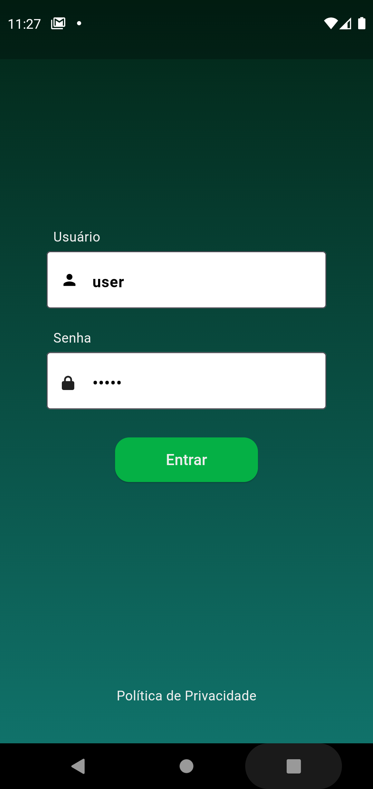
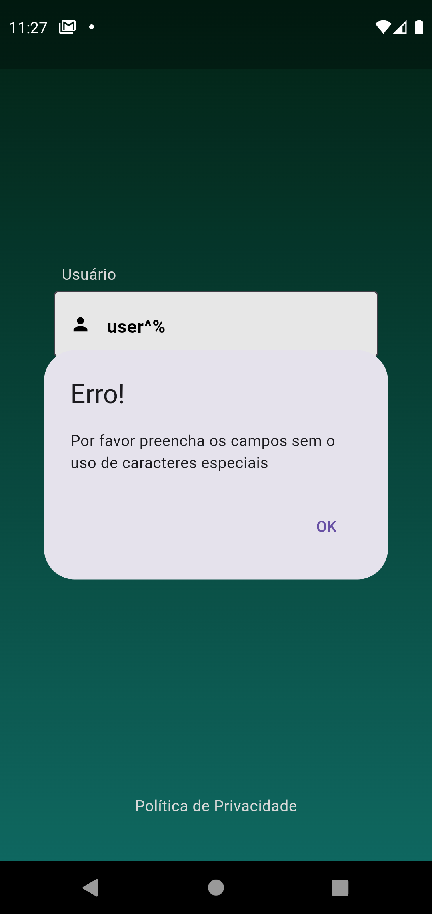
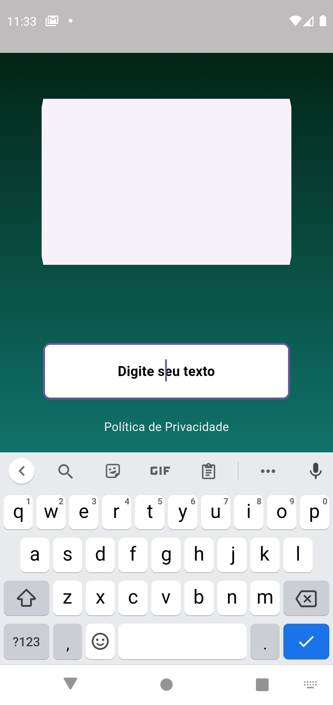
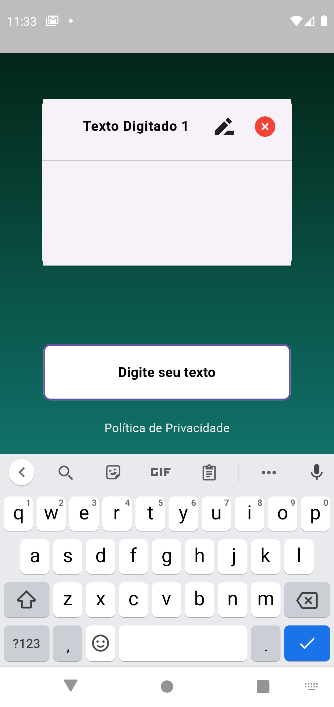
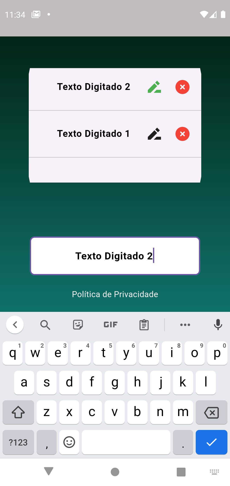
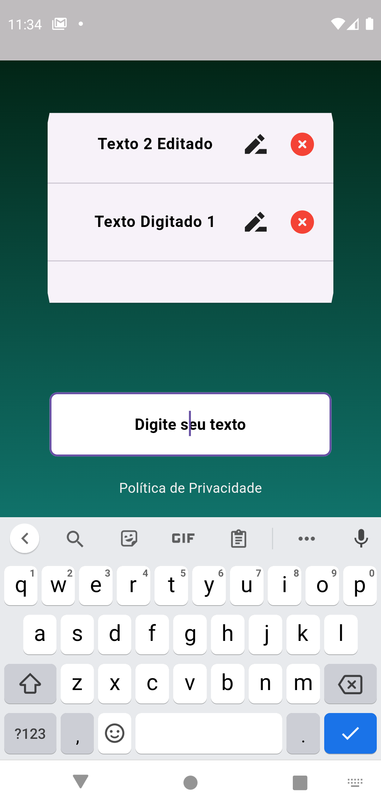
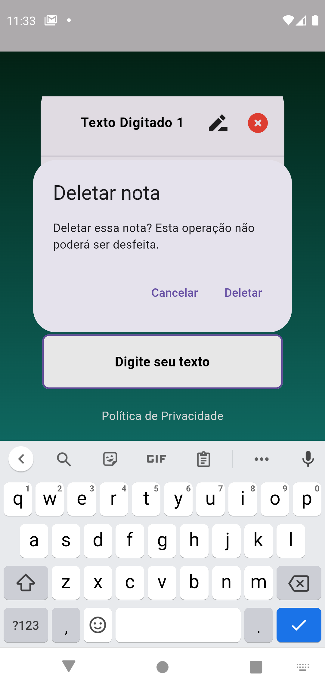
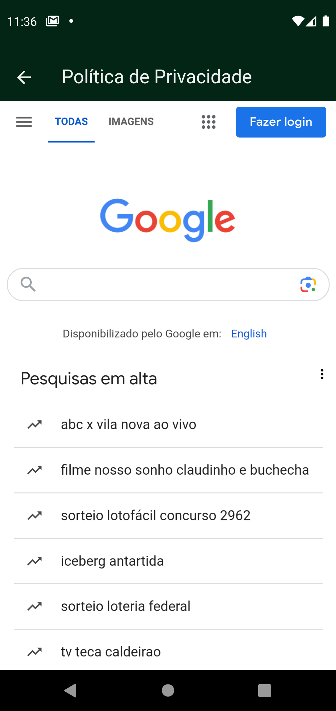

# Notas em MobX!

Este aplicativo foi desenvolvido seguindo os requisitos da prova do processo seletivo para a vaga de desenvolvedor Flutter. Ele foi testado num dispositivo físico e num dipositivo emulado, ambos Android.

# Tela de login

A tela de Login é a primeira tela do aplicativo. Se estiver em **modo debug** ela carregará já com os campos *Usuário* e *Senha* preenchidos. Cumprindo os requisitos da prova, esta tela **não registra um usuário**, ou seja, os dados dos campos *Usuário* e *Senha* não serão salvos ou carregados de nenhum lugar, apenas serão processados e, se forem válidos, o botão *Entrar* levará o usuário a tela de notas. 

## Validação de login

A validação de login está esquematizada para que os dados sejam enviados a uma API e lá sejam processados. Espera-se como retorno uma *Response* com um *atributo de uma estrutura de dados* e um *código de status*. Uma das preferências nos requisitos do desenvolvimento da prova é que fosse usado um *mockApi* para simular esta operação. **O código pode ser alterado para que use-se o *mocking* ou não**, alterando a variável booleana *mockApi* no arquivo *settings.dart* e implementando os requisitos da API desejada. **A intercessão está implementada** e o usuário só terá acesso a tela de Notas caso os campos preenchidos satisfaçam todos os requisitos do método *validate* do estado da aplicação em *app_state.dart*.

# Tela de notas

A tela de notas cumpre o pré-requisito de ter o **foco no campo de digitação sempre ativo** enquanto o usuário estiver na tela. **Isso implica que também o teclado estará sempre ativo**. Caso o usuário tente dispensar o teclado por meio do botão de retorno do teclado o aplicativo voltará a tela de Login. Clicar na tela sem que haja a intenção clara de sair do foco da tela de Notas não dispensará o teclado. 

## Lista de notas

As Notas serão carregadas caso existam pelo *Shared_Preferences* e armazenadas como modelos usando *observable lists* do *MobX*. Elas podem ser navegadas por rolagem pelo campo do *card* principal. A lista estará ordenada por ordem decrescente de modificação, ou seja, **a última nota criada ou modificada estará no topo da lista**.

## Criar uma nota

Escrever algo no campo de *"Digite seu texto"* e então apertar *"Enter"* no teclado salvará seu texto em uma nota e carregará ela no visor da lista de notas. Não há outra maneira de fazer o *submit* do texto, sendo este detalhe motivado pelo cumprimento rígido dos requisitos e da maior fidelidade possível a interface de usuário modelo. Não é possível salvar uma nota sem nenhum caractere.

## Editar uma nota

    
    
    

**Clicar no ícone de edição** logo ao lado do texto da nota trará o texto da mesma para o campo de digitação. Enquanto estiver em modo de edição o ícone ao lado do texto sendo editado estará da **cor verde** na lista de notas. **Clicar novamente no ícone cancela o modo de edição.** Selecionar "Enter" no teclado termina a edição e salva o texto editado,, trazendo a nota para o topo da lista.

## Deletar uma nota

**Clicar no ícone de x ao lado do texto da nota traz à tela uma janela de confirmação**. Confirmar deletará a nota.

# Tela de política de privacidade

**Ambos os links da para a tela de política de privacidade abrem o site de buscas Google** usando a biblioteca *WebView.* Voltar da tela de *WebView* voltará a tela anterior, seja ela a tela de login ou a tela de notas.